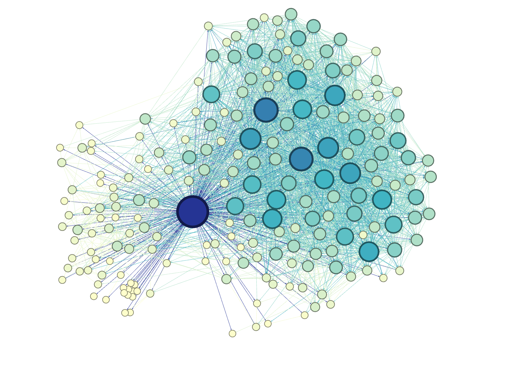

# Twitter-Friendship-Graph

In this project, we will crawl social media data from Twitter using the Tweepy Package, and then create and visual the Friendship Network of my twitter account.  i.e.  Represent all my friends on Twitter and whether there is a relation between any of them.

Example of graph result:

